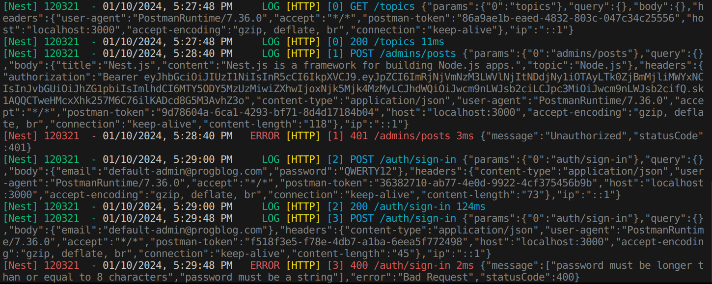

# NestJS HTTP Logger

[](https://www.npmjs.com/package/nestjs-http-logger)
[](https://www.npmjs.com/package/nestjs-http-logger)

A NestJS middleware, designed to facilitate logging of HTTP requests and responses, providing an efficient and straightforward way in debugging and monitoring network activity.



## Installation

```
npm install nestjs-http-logger
```

## Usage

After installation, the LoggerMiddleware can be imported and applied in the AppModule or any other module. It can be configured to log all routes ```('*')``` or specific ones, offering flexibility based on the developer's requirements.

Example configuration in AppModule:

```ts
import { LoggerMiddleware } from 'nestjs-http-logger'';

@Module()
export class AppModule {
  configure(consumer: MiddlewareConsumer) {
    consumer.apply(LoggerMiddleware).forRoutes('*');
  }
}
```

## excludeFromRequest

excludeFromRequest method allows you to specify which parts of the HTTP request should not be logged.

<b>Available Options:</b>

• ```params```: parameters from the route path<br>
• ```query```: key-value pairs in the URL after "?"<br>
• ```body```: content sent in POST/PUT requests<br>
• ```headers```: meta-info including authorization credentials<br>
• ```cookies```: data stored on the client for session tracking<br>
• ```ip```: client's IP address, identified by the server

Example of excluding ```headers``` from logging:

```ts
import { LoggerMiddleware } from 'nestjs-http-logger'';

@Module()
export class AppModule {
  configure(consumer: MiddlewareConsumer) {
    // Call 'excludeFromRequest' before 'consumer.apply'
    LoggerMiddleware.excludeFromRequest({ headers: true });
    consumer.apply(LoggerMiddleware).forRoutes('*');
  }
}
```

## Recommendation

In a production environment, consider excluding sensitive parts of the request such as the ```body```, ```headers```, and ```cookies``` from logging, as they may contain personal information, passwords, authentication tokens, session cookies, and more.

```ts
import { LoggerMiddleware } from 'nestjs-http-logger'';

@Module()
export class AppModule {
  configure(consumer: MiddlewareConsumer) {
    const isProduction = process.env.NODE_ENV === 'production';
    LoggerMiddleware.excludeFromRequest({
      body: isProduction,
      headers: isProduction,
      cookies: isProduction,
    });
    consumer.apply(LoggerMiddleware).forRoutes('*');
  }
}
```

## Author

Vladyslav Braslavskyi [GitHub](https://github.com/vlbras)

## License

Licensed under the MIT License - see the [LICENSE](LICENSE) file for details.
